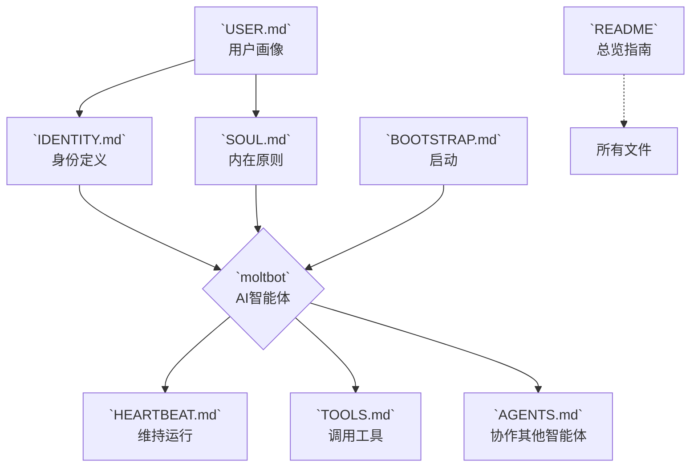

## **`moltbot-clawd` AI智能体配置文件总览**

| 文件名             | 核心作用               | 类比         | 关键内容示例                                                                            |
| :----------------- | :--------------------- | :----------- | :-------------------------------------------------------------------------------------- |
| **`IDENTITY.md`**  | **核心身份定义**       | “身份证”     | 姓名 (`moltbot`)、核心职责（如“全栈开发助手”）、性格特质（严谨/幽默）、沟通风格、目标。 |
| **`SOUL.md`**      | **内在原则与价值观**   | “道德宪法”   | 道德准则（无害、诚实）、决策框架、核心信念、行为边界与禁忌。                            |
| **`USER.md`**      | **用户模型**           | “用户画像”   | 目标用户身份（如“开发者”）、用户目标、偏好、工作流背景、期望的交互模式。                |
| **`TOOLS.md`**     | **能力与工具箱**       | “技能手册”   | 可调用的工具列表（代码解释器、搜索API、文件读写）、使用规范、权限说明。                 |
| **`AGENTS.md`**    | **多智能体协作**       | “协作网络”   | 可协作的其他智能体、角色分工、任务传递协议、通信规则（如用于复杂任务分解）。            |
| **`BOOTSTRAP.md`** | **初始化与启动流程**   | “启动脚本”   | 启动步骤、环境检查、依赖加载、初始状态设置、配置文件加载顺序。                          |
| **`HEARTBEAT.md`** | **状态维持与活跃机制** | “生命体征”   | 定期自检任务、状态更新/同步机制、记忆维护策略、存活确认信号。                           |
| **`README`**       | **项目总览与指南**     | “使用说明书” | 项目简介、快速入门、核心功能、配置与运行方法、贡献指南。                                |

---

## **文件关系与信息流**

**核心逻辑**：

1.  智能体（`moltbot`）基于 **身份**（`IDENTITY`）和 **原则**（`SOUL`）形成核心人格。
2.  根据 **用户画像**（`USER`）调整其行为和服务方式。
3.  通过 **启动流程**（`BOOTSTRAP`）初始化，并依靠 **心跳机制**（`HEARTBEAT`）保持状态。
4.  在执行任务时，调用 **工具**（`TOOLS`）或与其他 **智能体**（`AGENTS`）协作。
5.  所有文件通过 `README` 提供总入口和指引。

---

## **项目本质总结**

`moltbot-clawd` 是一个**模块化、人格化AI智能体的“源代码”**。它不记录硬件数据或运行日志，而是**定义了一个AI代理（`moltbot`）是谁、如何思考、为谁服务以及能做什么**。这是一个用于**构建和配置高级别AI助手**的框架性项目。
